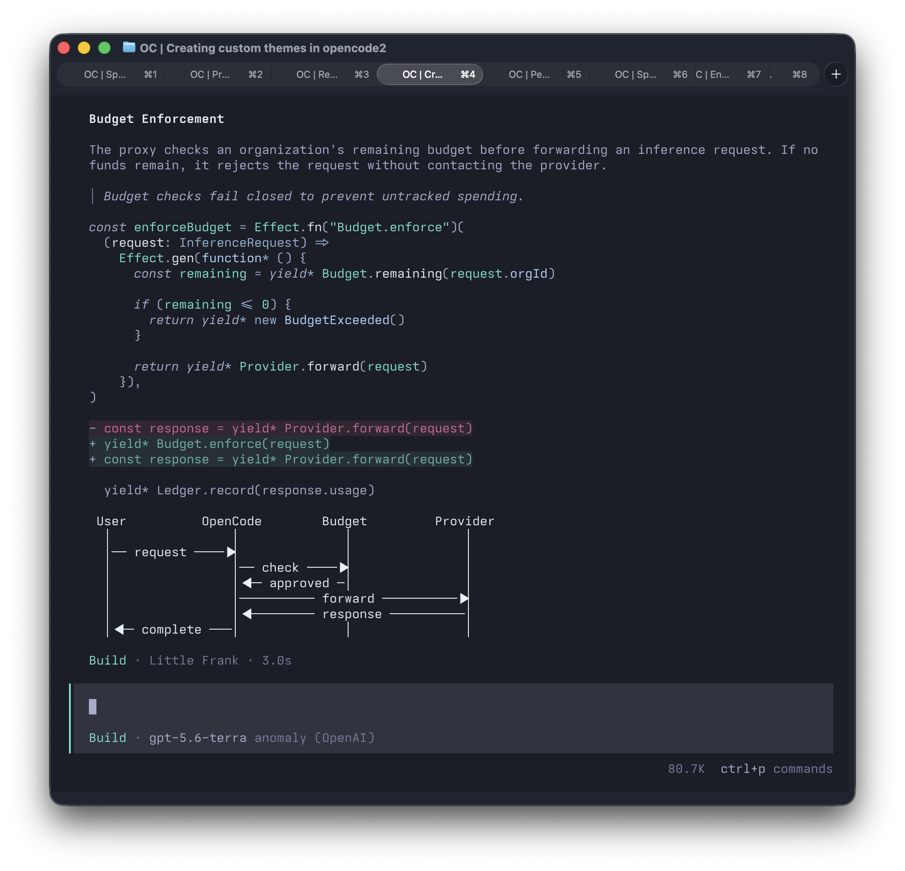

# Themes for OpenCode

Themes for OpenCode covering the TUI, Markdown, syntax highlighting, and diffs.

## Poimandres

An unofficial port of the
[Poimandres](https://github.com/drcmda/poimandres-theme) palette.



### Palette


## Fieldline

A dark scientific-instrument theme with turquoise displays, lime controls,
violet indicators, amber readouts, copper panels, and red warning lights.


### Palette


## Install

```sh
mkdir -p ~/.config/opencode/themes
curl -fsSL \
  https://raw.githubusercontent.com/vaprdev/opencode-poimandres-theme/main/themes/poimandres.json \
  -o ~/.config/opencode/themes/poimandres.json

curl -fsSL \
  https://raw.githubusercontent.com/vaprdev/opencode-poimandres-theme/main/themes/fieldline.json \
  -o ~/.config/opencode/themes/fieldline.json
```

Open OpenCode and run `/theme`, then select `poimandres` or `fieldline`.

The same theme file works with OpenCode 1 and the OpenCode 2 preview.

## Update

Run the installation command again to download the latest version.

## Credits

The palette is based on
[Poimandres](https://github.com/drcmda/poimandres-theme) by drcmda. This is an
unofficial port and is not affiliated with or endorsed by the original
project.

## License

[MIT](LICENSE)
