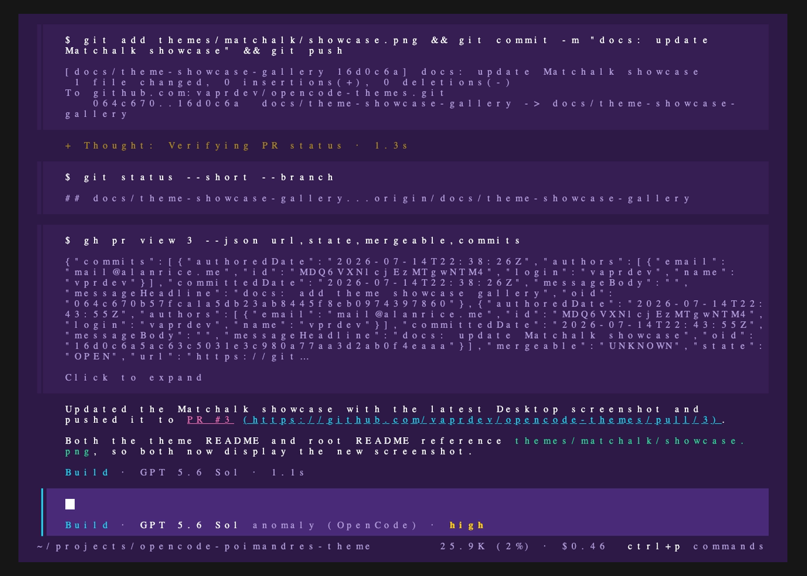
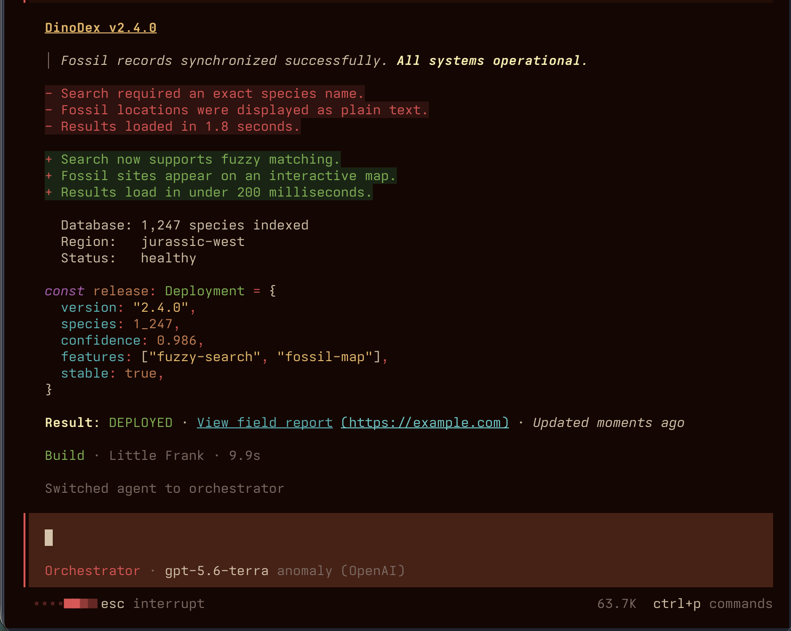
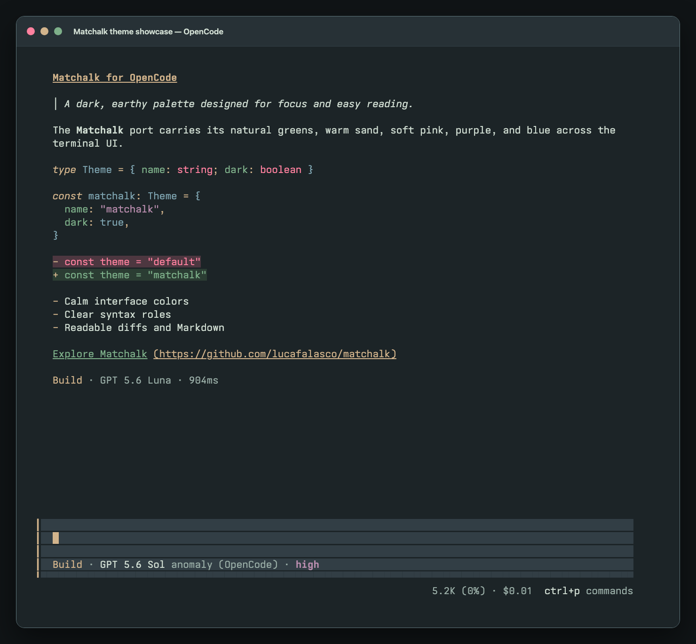

# OpenCode Themes

An independent collection of community themes for the OpenCode terminal user
interface, Markdown, syntax highlighting, and diffs.

> This project is not affiliated with, endorsed by, or sponsored by OpenCode
> or its maintainers. Theme names, logos, and other marks belong to their
> respective owners.

## Themes

| Theme | Description |
| --- | --- |
| [Candy Pop Dark](themes/candy-pop-dark/) | Candy pink and electric cyan on a deep purple background. |
| [Candy Pop Light](themes/candy-pop-light/) | Saturated rose and cyan on soft pink surfaces. |
| [Fieldline](themes/fieldline/) | Dark scientific instruments in oxblood, turquoise, lime, violet, amber, copper, and red. |
| [Matchalk](themes/matchalk/) | An unofficial port of Matchalk's dark, earthy palette. |
| [Poimandres](themes/poimandres/) | An unofficial port of the Poimandres palette. |

Each theme directory is self-contained and includes installation instructions,
its palette and showcase assets, license information, and any required
attribution.

## Gallery

### Candy Pop Dark

### Candy Pop Light

### Fieldline

### Matchalk

### Poimandres

## Add A Theme

Create `themes/<theme-name>/` with:

- `theme.json`
- `README.md` with installation instructions
- `showcase.png` demonstrating the theme in OpenCode
- `LICENSE` when its license differs from the repository MIT license

Keep theme-specific screenshots, palette artwork, and attribution in that
directory. Add every new theme to both the table and gallery above, linking its
gallery image to the theme directory.

## License

Unless a theme directory states otherwise, this repository is licensed under
the [MIT License](LICENSE).
