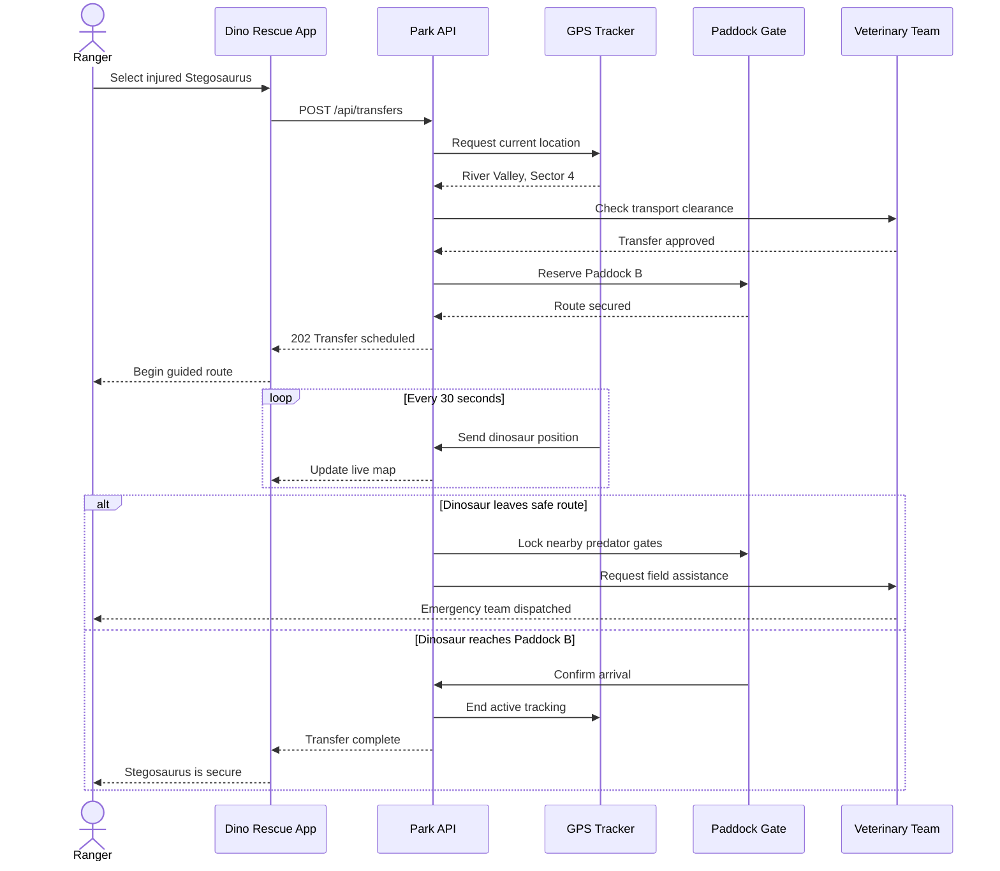

# Theme Showcase Standard

Every theme showcase should render the same OpenCode conversation so visual
differences come from the theme rather than the content, terminal, or viewport.

## Fixture

Use this prompt in a fresh OpenCode session:

````text
Reply with exactly the following Markdown and no additional text:

# Dino Rescue: Paddock Transfer



```diff
diff --git a/src/transfers.ts b/src/transfers.ts
index 18a4d21..72bc901 100644
--- a/src/transfers.ts
+++ b/src/transfers.ts
@@ -14,8 +14,12 @@ export async function transferDinosaur(dinosaur: Dinosaur) {
-  const paddock = await findOpenPaddock()
-  return moveDinosaur(dinosaur, paddock)
+  const paddock = await findSafePaddock(dinosaur.species)
+  const route = await reserveRoute(dinosaur.location, paddock)
+
+  await notifyVeterinaryTeam(dinosaur)
+  await beginLiveTracking(dinosaur, route)
+
+  return { paddock, route, status: "in_transit" }
 }
```
````

## Capture

1. Use Ghostty with `Ioskeley Mono` at 14 pt.
2. Size the window to 120 columns by 55 rows.
3. Open the fixture session and scroll to show the lower sequence diagram, the
   complete diff, assistant metadata, prompt panel, and status line.
4. Switch only the OpenCode theme between captures. Do not resize or scroll.
5. Use macOS window capture (`command+shift+4`, then `space`) and click the
   Ghostty window.
6. Save the image as `themes/<theme-name>/showcase.png` without cropping or
   adding simulated window decorations.

The separate `palette.svg` remains the authoritative full color reference. The
showcase demonstrates how those colors work together in the real OpenCode TUI.
