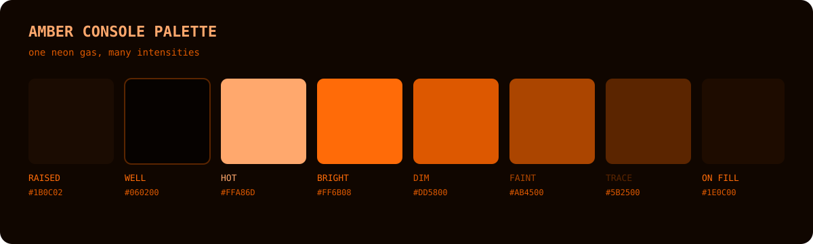

# Amber Console

An unofficial OpenCode port of
[Amber Console](https://github.com/DutchDiederik/AmberConsole) by Diederik. It
uses the project's default neon-discharge ramp: one orange hue at several
intensities on warm-black industrial display surfaces.

## Palette



## Install

```sh
mkdir -p ~/.config/opencode/themes
curl -fsSL \
  https://raw.githubusercontent.com/vaprdev/opencode-themes/main/themes/amber-console/theme.json \
  -o ~/.config/opencode/themes/amber-console.json
```

Open OpenCode, run `/theme`, then select `amber-console`.

## Attribution And License

The colors are based on Amber Console's default neon gas palette. OpenCode
cannot reproduce the original framework's bitmap fonts, glow, scanlines,
afterglow, blinking, or component layout. This unofficial port is not
affiliated with or endorsed by the original project. The included
[BSD 3-Clause License](LICENSE) preserves the upstream copyright and terms.
