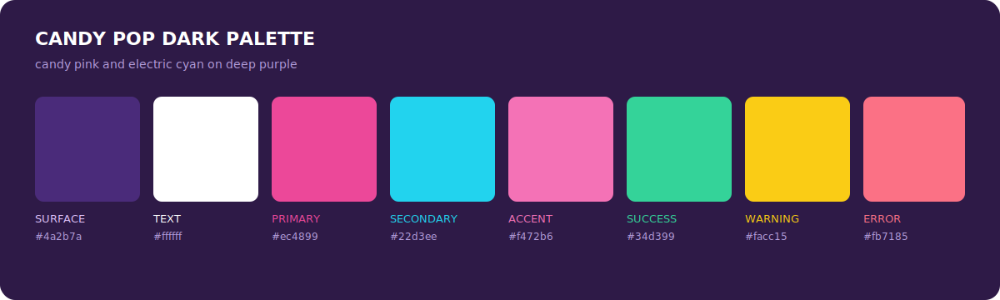

# Candy Pop Dark

An unofficial OpenCode port of the dark
[Candy Pop](https://github.com/Fedolodic/candy-pop-themes) palette by State Of
The Art. It pairs candy pink and cyan with a deep purple interface.


## Palette



## Install

```sh
mkdir -p ~/.config/opencode/themes
curl -fsSL \
  https://raw.githubusercontent.com/vaprdev/opencode-themes/main/themes/candy-pop-dark/theme.json \
  -o ~/.config/opencode/themes/candy-pop-dark.json
```

Open OpenCode, run `/theme`, then select `candy-pop-dark`.

For the light variant, see [Candy Pop Light](../candy-pop-light/).

## Attribution And License

The colors and syntax roles are based on Candy Pop by State Of The Art. The
original animated glow and particle effects are outside the scope of an
OpenCode TUI theme. This unofficial port is not affiliated with or endorsed by
the original project. The included [MIT License](LICENSE) preserves the
upstream copyright and permissions.
