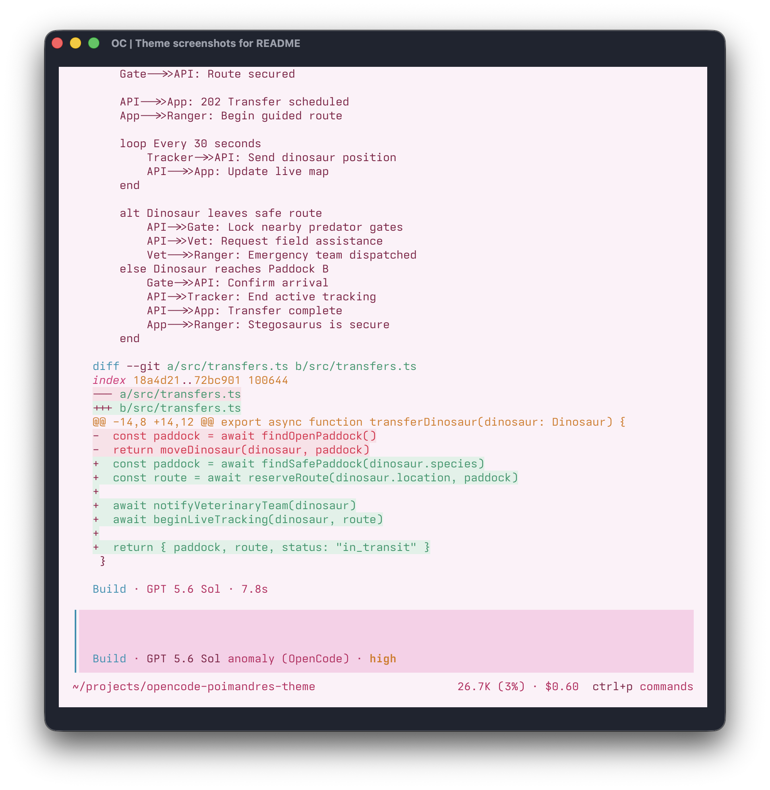
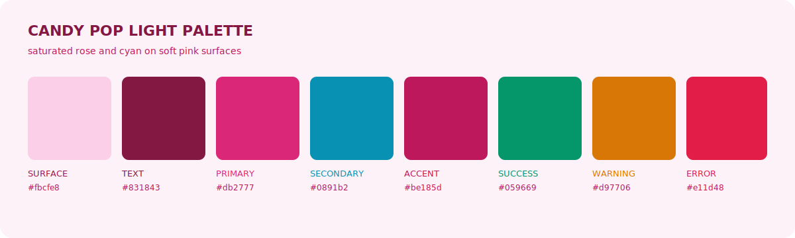

# Candy Pop Light

An unofficial OpenCode port of the light
[Candy Pop](https://github.com/Fedolodic/candy-pop-themes) palette by State Of
The Art. It pairs saturated rose and cyan with soft pink surfaces.



## Palette



## Install

```sh
mkdir -p ~/.config/opencode/themes
curl -fsSL \
  https://raw.githubusercontent.com/vaprdev/opencode-themes/main/themes/candy-pop-light/theme.json \
  -o ~/.config/opencode/themes/candy-pop-light.json
```

Open OpenCode, run `/theme`, then select `candy-pop-light`.

For the dark variant, see [Candy Pop Dark](../candy-pop-dark/).

## Attribution And License

The colors and syntax roles are based on Candy Pop by State Of The Art. The
original animated glow and particle effects are outside the scope of an
OpenCode TUI theme. This unofficial port is not affiliated with or endorsed by
the original project. The included [MIT License](LICENSE) preserves the
upstream copyright and permissions.
