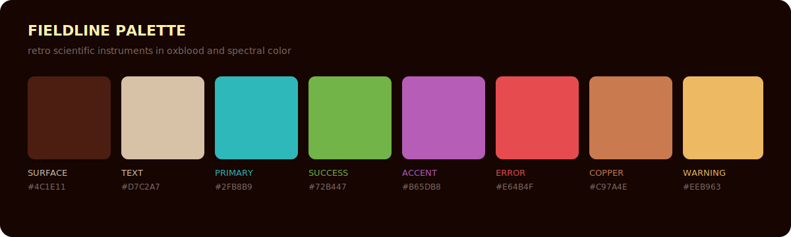

# Fieldline

A dark scientific-instrument theme with turquoise displays, lime controls,
violet indicators, amber readouts, copper panels, and red warning lights.


## Palette



## Install

```sh
mkdir -p ~/.config/opencode/themes
curl -fsSL \
  https://raw.githubusercontent.com/vaprdev/opencode-themes/main/themes/fieldline/theme.json \
  -o ~/.config/opencode/themes/fieldline.json
```

Open OpenCode, run `/theme`, then select `fieldline`.

## License

[MIT](../../LICENSE)
