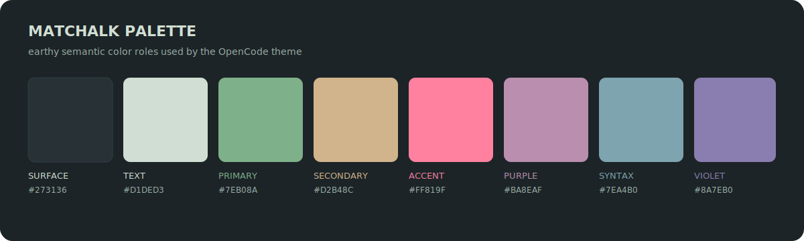

# Matchalk

An unofficial OpenCode port of
[Matchalk](https://github.com/lucafalasco/matchalk), Luca Falasco's dark,
earthy VS Code theme.


## Palette



## Install

```sh
mkdir -p ~/.config/opencode/themes
curl -fsSL \
  https://raw.githubusercontent.com/vaprdev/opencode-themes/main/themes/matchalk/theme.json \
  -o ~/.config/opencode/themes/matchalk.json
```

Open OpenCode, run `/theme`, then select `matchalk`.

## Attribution And License

The colors and syntax roles are based on Matchalk by Luca Falasco. This
unofficial port is not affiliated with or endorsed by the original project.
The included [MIT License](LICENSE) preserves the upstream copyright and
permissions.
