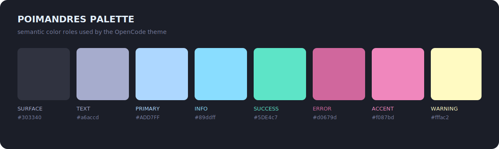

# Poimandres

An unofficial port of the
[Poimandres](https://github.com/drcmda/poimandres-theme) palette for OpenCode.


## Palette



## Install

```sh
mkdir -p ~/.config/opencode/themes
curl -fsSL \
  https://raw.githubusercontent.com/vaprdev/opencode-themes/main/themes/poimandres/theme.json \
  -o ~/.config/opencode/themes/poimandres.json
```

Open OpenCode, run `/theme`, then select `poimandres`.

## Attribution And License

The palette is based on Poimandres by drcmda. This unofficial port is not
affiliated with or endorsed by the original project. The included
[MIT License](LICENSE) preserves the upstream copyright and permissions.
