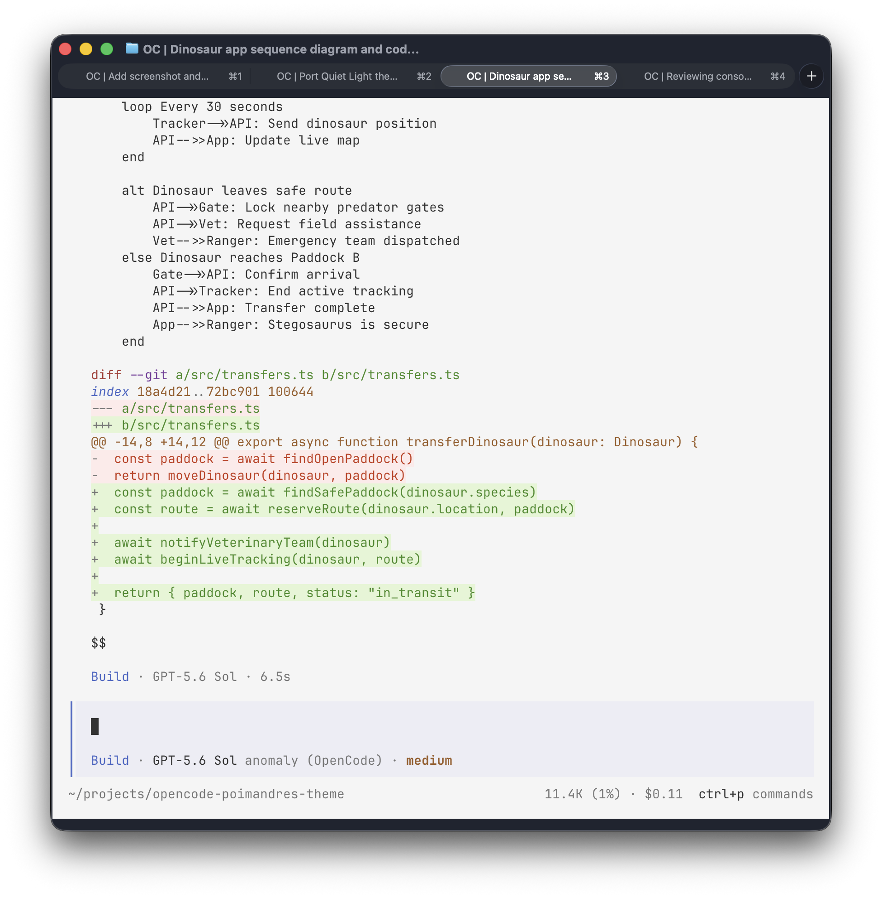
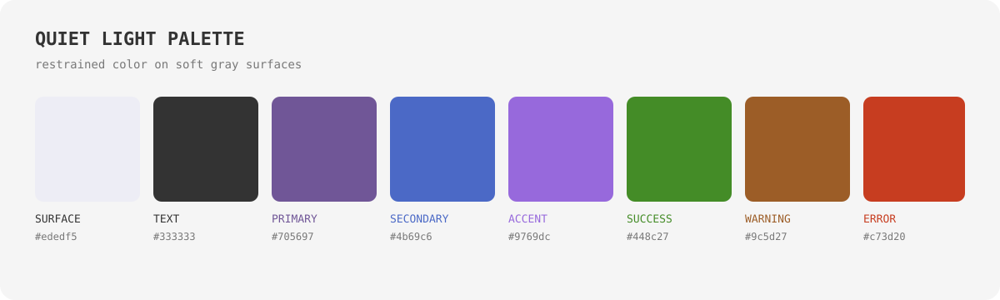

# Quiet Light

An unofficial OpenCode port of Microsoft's
[Quiet Light](https://github.com/microsoft/vscode/blob/main/extensions/theme-quietlight/themes/quietlight-color-theme.json)
theme for Visual Studio Code. It pairs soft gray surfaces and muted purple UI
accents with clear, restrained syntax colors.



## Palette



## Install

```sh
mkdir -p ~/.config/opencode/themes
curl -fsSL \
  https://raw.githubusercontent.com/vaprdev/opencode-themes/main/themes/quiet-light/theme.json \
  -o ~/.config/opencode/themes/quiet-light.json
```

Open OpenCode, run `/theme`, then select `quiet-light`.

## Attribution And License

The colors and syntax roles are based on Quiet Light from Visual Studio Code
by Microsoft Corporation. This unofficial port is not affiliated with or
endorsed by Microsoft. The included [MIT License](LICENSE) preserves the
upstream copyright and permissions.
